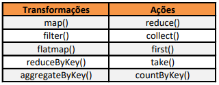

<h1>Bank Marketing Classifier</h1>

<h3>Prevendo se o cliente vai adquirir um empréstimo com o uso de PySpark</h3>

---

Prever se o cliente vai adquirir um determinado serviço é um grande desafio para qualquer empresa. No ramo das instituições financeiras, um desses serviços é o empréstimo à prazo. No qual, o banco empresta dinheiro para o seu cliente e vai recebendo uma parcela desse empréstimo com acréscimo de juros todos os meses. 

Contudo, a taxa de conversão de clientes com o uso de canais telemarketing é extremamente baixa, tornando o processo operacional custoso e improdutivo para o banco. 

A aplicação de modelos preditivos permite identificar quais são os clientes mais propensos a adquirir um empréstimo. E dessa forma, é possível otimizar esse serviço para que os canais de telemarketing direcionem os esforços para atingir os clientes com maior propensão de adquirir o empréstimo.

Uma forma de construir modelos preditivos é através de programação utilizando a combinação de Python com o framework Spark, denominado PySpark. O uso dessa ferramenta é bastante relevante, dado que o volume de dados em instituições financeiras é bastante alto (Big Data) e o PySpark suporta muito bem a escalabilidade desses dados.

Com a utilização do PySpark e MLlib, este projeto se propõe ao desenvolvimento de uma modelo de Machine Learning que com base nos dados históricos, seja capaz de predizer se o cliente vai ou não adquirir o empréstimo no banco. O projeto percorre por todas as etapas de uma modelagem e no final será desenvolvido um modelo pronto para ser exportando para outros ambientes, como o ambiente em nuvem da Amazon, por exemplo.

Repositório: <a target="_blank" href="https://github.com/Krupique/pyspark-projects/edit/main/01-BankMarketingClassifier">github.com/BankMarketingClassifier</a>

---

<h2>SUMÁRIO</h2>

* <a href="#id_1">1) INTRODUÇÃO AO TEMA</a>
    * <a href="#id_1.1">1.1) Bank Marketing</a>
    * <a href="#id_1.2">1.2) Machine Learning</a>
    * <a href="#id_1.3">1.3) Machine Learning e o Bank Marketing</a>
    * <a href="#id_1.4">1.4) Objetivos do Projeto</a>
    * <a href="#id_1.5">1.5) Sobre o Dataset</a>
    * <a href="#id_1.6">1.6) Introdução ao Apache Spark</a>
    * <a href="#id_1.7">1.7) PySpark</a>
<br/><br/>

* <a href="#id_2">2) INÍCIO DO PROJETO</a>
    * <a href="#id_2.1">2.1) Carregamento dos Dados e Importações</a>
    * <a href="#id_2.2">2.2) Visão Geral</a>
    * <a href="#id_2.3">2.3) Tratamento de Valores Ausentes</a>
<br/><br/>

* <a href="#id_3">3) PRÉ PROCESSAMENTO DOS DADOS</a>
    * <a href="#id_3.1">3.1) Encoding dos Dados</a>
        * <a href="#id_3.2">3.1.1) Label Encoder</a>
        * <a href="#id_3.3">3.1.2) One Hot Encoder</a>
    * <a href="#id_3.4">3.2) Alterando o tipo de Dado</a>
    * <a href="#id_3.5">3.3) Conversão para Vetor Denso</a>
    * <a href="#id_3.5">3.4) Escala dos Dados</a>
    * <a href="#id_3.6">3.5) Divisão em Treino, Teste e Validação</a>
    * <a href="#id_3.7">3.6) Balanceamento de classes</a>
    * <a href="#id_3.8">3.7) Feature Selection</a>
<br/><br/>

* <a href="#id_4">4) MODELAGEM</a>
    * <a href="#id_4.1">4.1) Modelagem Base</a>
    * <a href="#id_4.2">4.2) Aplicando GridSearch e Cross Validation</a>
<br/><br/>

* <a href="#id_5">5) AVALIAÇÃO</a>
    * <a href="#id_5.1">5.1) Avaliação do Modelo</a>
    * <a href="#id_5.2">5.2) Salvando o modelo</a>
    * <a href="#id_5.3">5.3) Carregando o modelo</a>
<br/><br/>

* <a href="#id_6">6) FINAL</a>
    * <a href="#id_6.1">6.1) Considerações Finais</a>
    * <a href="#id_6.2">6.2) Agradecimentos</a>
    * <a href="#id_6.3">6.3) Referências</a>

---

<h2 id="id_1">1) INTRODUÇÃO AO TEMA</h2>

O marketing está presente nas nossas vidas muito mais do que imaginamos. Faça uma caminhada pelas ruas da cidade, uma busca no seu navegador, ligue a televisão ou o rádio, abra sua rede social e você será impactado por alguma ação de marketing.

Mas o que é marketing?
Para Philip Kotler, um dos teóricos mais renomados da área, define marketing como:
> *Marketing é a ciência e arte de explorar, criar e proporcionar valor para satisfazer necessidades de um público-alvo com rendibilidade.*

O campo do marketing é vasto e inclui não apenas o ato de vender um produto ou serviço, mas tudo relacionado ao planejamento, pesquisa e posicionamento de mercado. Em outras palavras, pode-se dizer que o marketing é como uma balança entre o que os clientes desejam e os objetivos da empresa. Afinal, um bom marketing precisa criar valor para ambas as partes: para a empresa e para o consumidor.

Vale ressaltar que marketing é uma palavra em inglês, derivada de market (mercado). Portanto, marketing não é apenas vender produtos ou serviços, engloba também outras atividades relacionadas ao mercado.

---

<h3 id="id_1.1">1.1) Bank Marketing</h3>

Um tipo de instituição que aplica marketing no seu dia a dia são os bancos, para isso, damos o nome Bank Marketing (Marketing Bancário). O marketing bancário é a prática de atrair e adquirir novos clientes por meio de estratégias de mídia tradicional e mídia digital. O uso dessas estratégias de mídia ajuda a determinar que tipo de cliente é atraído por uma determinada instituição. Isso também inclui diferentes instituições bancárias que usam propositalmente diferentes estratégias para atrair o tipo de cliente com o qual desejam fazer negócios.

E você sabe como as principais empresas fazem atualmente para aplicar estratégias de Marketing?<br/>
Se você respondeu, "elas aplicam técnicas de Inteligência Artificial e Machine Learning para entender e avaliar o comportamento dos seus clientes". Parabéns, você acertou!
Mas antes de explicar com elas fazem isso, vamos começar entendendo um pouco sobre o que é Machine Learning.

---

<h3 id="id_1.2">1.2) Machine Learning</h3>

O Machine Learning, ou aprendizado de máquina. É um subcampo da inteligência artificial que permite dar aos computadores a habilidade de aprender sem que sejam explicitamente programados para isso. Ela permite que computadores tomem decisões e interpretem dados de maneira automática, a partir de algoritmos. Temos vários tipos de aprendizagem, são elas: Supervisionada, não supervisionada, semi supervisionada, aprendizagem por reforço e deep learning.
	
Os algoritmos de aprendizagem de máquina, aprendem a induzir uma função ou hipótese capaz de resolver um problema a partir de dados que representam instâncias do problema a ser resolvido.

Um algoritmo é uma sequência finita de ações e regras que visam a solucionar um problema. Cada um deles aciona um diferente tipo de operação ao entrar em contato com os dados que o computador recebe. O resultado de todas as operações é o que possibilita o aprendizado da máquina.

Dessa forma, as máquinas aperfeiçoam as tarefas executadas, por meio de processamento de dados como imagens e números. Por isso o machine learning depende do Big Data para ser efetivo. O Big Data, por sua vez pode ser entendido de maneira simplória como uma imensa quantidade de dados. Mas calma, ainda irei falar mais em detalhes sobre isso. Por ora, vamos entender como o Machine Learning e a Inteligência Artificial ajudam a benefeciar a área de Bank Marketing.

---

<h3 id="id_1.3">1.3) Machine Learning e o Bank Marketing</h3>

Abaixo irei listar alguns benefícios do Machine Learning (ML) aplicado na área de Bank Marketing:
* **Atendimento ao cliente orientado por IA**: Existem muitas maneiras de tornar o atendimento ao cliente realmente orientado por IA ou, melhor dizer, orientado por dados. Por exemplo, com a ajuda da análise de dados, a instituição bancária pode descobrir as intenções de compra do cliente e oferecer um empréstimo flexível. Além disso, os principais bancos criam chatbots inteligentes que ajudam os clientes a interagir melhor com as empresas financeiras. Com a ajuda de aplicativos inteligentes, os clientes podem acompanhar automaticamente seus gastos, planejar seu orçamento e obter sugestões precisas de economia e investimento.
* **Segmentação de clientes**: Com ML, é possível encontrar características semelhantes e padrões entre os dados dos clientes. Dessa forma, o algoritmo de ML consegue separar os clientes em grupos, possibilitando que a equipe de Marketing possa direcionar os esforços de maneira individual para cada grupo de clientes.
* **Otimização de lances em anúncios**: os anúncios em buscadores funcionam no sistema de leilões de pesquisa. Ou seja, quem der o maior lance aparecerá em primeiro lugar nos resultados de pesquisa para uma determinada palavra-chave. Para fazer o lance perfeito, o marketing se utiliza do machine learning. Ele analisa milhões de dados para ajustar os lances em tempo real.
* **Prever os possíveis clientes**: Com base nos dados históricos da empresa, podemos coletar e entender qual é o perfil dos clientes. E com base nisso, prever a probabilidade do indivíduo adquirir determinado serviço. Como por exemplo, contrair um empréstimo, adquirir investimentos, dentre outros.

---

<h3 id="id_1.4">1.4) Objetivos do Projeto</h3>

Como objetivo específico do problema de negócio, irei aplicar técnicas de Machine Learning para identificar e prever ser se o cliente vai ou não adquirir o empréstimo no banco.

Como objetivo de estudo de tecnologia, estarei utilizando do início ao fim do projeto o framework Apache Spark, mais especificamente, o PySpark. PySpark é uma API Python para Apache SPARK que é denominado como o mecanismo de processamento analítico para aplicações de processamento de dados distribuídos em larga escala e aprendizado de máquina em tempo real, ou seja, para grandes volumes de dados, conhecido como Big Data.

---

<h3 id="id_1.5">1.5) Sobre o Dataset</h3>

Este conjunto de dados contém 20 atributos e 41189 registos relevantes para uma campanha de marketing direto de uma instituição bancária portuguesa. A campanha de marketing foi executada por meio de ligações telefônicas. O objetivo da classificação é prever se o cliente irá aderir (yes/no) ao CDB (variável y).<br/>

O dataset pode ser obtido no site do Kaggle, clicando [aqui](https://www.kaggle.com/datasets/ruthgn/bank-marketing-data-set)

> **Nota**: Eu alterei alguns registros do dataset para forçar a situação de dados missing/nulos. Para que dessa forma eu consiga desenvolver e detalhar a etapa de tratamento de valores NA.

Atributos do Dataset:
* AGE: Idade do indivíduo.<br/>
* JOB: Emprego.<br/>
* MARITAL: Status de estado civil: ('casado', 'solteiro', 'divorciado').<br/>
* EDUCATION: Nível de escolaridade<br/>
* DEFAULT: Se possui crédito inadimplente.<br/>
* HOUSING: Possui credito à habitação.<br/>
* LOAN: Se possui empréstimo.<br/>
* CONTACT: Tipo de contato: ('Telefone' ou 'Smartphone').<br/>
* MONTH: Mês do ano.<br/>
* DAY OF WEEK: Dia da semana.<br/>
* CAMPAIGN: Quantidade de contatos realizados durante esta campanha e para este cliente.<br/>
* PDAYS: Quantidade de dias que se passaram depois que o cliente foi contatado pela última vez em uma campanha anterior.<br/>
* PREVIOUS: Quantidade de contatos realizados antes desta campanha e para este cliente.<br/>
* POUTCOME: Resultado da campanha de marketing anterior ('fracasso', 'inexistente', 'sucesso').<br/>
* EMP.VAR.RATE: Taxa de variação do emprego - indicador trimestral.<br/>
* CONS.PRICE.IDX: Índice de preços ao consumidor - indicador mensal.<br/>
* CONS.CONF.IDX: Índice de confiança do consumidor - indicador mensal.<br/>
* EURIBOR3M: Taxa de 3 meses euribor - indicador diário.<br/>
* NR.EMPLOYED: Número de funcionários - indicador trimestral.<br/>


* Y: Variável alvo. Verifica se o cliente adquiriu o empréstimo.<br/>

---

<h3 id="id_1.6">1.6) Introdução ao Apache Spark</h3>

Apache Spark é uma estrutura de código aberto que simplifica o desenvolvimento e a eficiência dos trabalhos de análise de dados. Ele oferece suporte a uma ampla variedade de opções de API e linguagem com mais de 80 operadores de transformação e ação de dados que ocultam a complexidade da computação em cluster.

Com velocidades relatadas 100 vezes mais rápidas do que mecanismos de análise semelhantes, o Spark pode acessar fontes de dados variáveis e ser executado em várias plataformas, incluindo Hadoop, Apache Mesos, Kubernetes, de forma independente ou na nuvem. Seja processando dados em lote ou streaming, você verá um desempenho de alto nível devido ao agendador Spark DAG de última geração, um otimizador de consulta e um mecanismo de execução física.

> Caso você queira saber mais sobre o Apache Spark, eu recomendo fortemente a leitura do artigo "Spark: entenda sua função e saiba mais sobre essa ferramenta", publicado pelo blog XP Educação, que pode ser acessado clicando [aqui](https://blog.xpeducacao.com.br/apache-spark/)

---

<h3 id="id_1.7">1.7) PySpark</h3>

PySpark é a colaboração do Apache Spark e do Python.

O Apache Spark é uma estrutura de computação em cluster de código aberto, construída em torno da velocidade, facilidade de uso e análise de streaming, enquanto o Python é uma linguagem de programação de alto nível e de uso geral. Ele fornece uma ampla variedade de bibliotecas e é usado principalmente para Machine Learning e Real-Time Streaming Analytics.

Em outras palavras, é uma API Python para Spark que permite aproveitar a simplicidade do Python e o poder do Apache Spark para domar o Big Data. 

O uso da biblioteca PySpark possui diversas vantagens:
* É um mecanismo de processamento distribuído, na memória, que permite o processamento de dados de forma eficiente e utilizando a característica de computação distribuída.
* Com o uso do PySpark, é possível o processamento de dados em Hadoop (HDFS), AWS S3 e outros sistemas de arquivos.
* Possui quatro grandes funcionalidades: Manipulação e integração SQL, Streaming de Dados, MLlib para Machine Learning e GraphX para manipulação de grafos.
* Segundo os desenvolvedores, o Apache Spark é até 100x mais rápido em termos de processamento distribuído quando comparado com o Hadoop. 

Toda a execução dos scripts são realizados dentro do Apache Spark, que distribui o processamento dentro de um ambiente de cluster que são interligados aos NÓs que realizam a execução e transformação dos dados.


---

<h2 id="id_2">2) INÍCIO DO PROJETO</h2>

Depois de todas as definições, vamos iniciar o projeto. O conteúdo programático segue a estrutura padrão de projetos desse tipo. Iniciando pelo carregamento dos dados.


<h3 id="id_2.1">2.1) Carregamento dos Dados e Importações</h3>

Irei utilizar funções de dois dos quatro principais módulos do Spark. Funções do módulo de SQL e também do MLLib.


```python
#import pyspark.sql.functions as F
from pyspark.sql import Row #Converte RDDs em objetos do tipo Row
from pyspark.sql.functions import col, isnan, when, count # Encontra a contagem para valores None, Null, Nan, etc.
from pyspark.sql.types import IntegerType, FloatType

from pyspark.ml.feature import StringIndexer, OneHotEncoder #Converte strings em valores numéricos
from pyspark.ml.linalg import Vectors #Serve para criar um vetor denso
from pyspark.ml.evaluation import MulticlassClassificationEvaluator # Para avaliar o modelo com as métricas de avaliação.
from pyspark.ml.feature import RobustScaler, StandardScaler, MinMaxScaler, Normalizer # Métodos para escalas dos dados
from pyspark.ml.classification import RandomForestClassifier, LogisticRegression, GBTClassifier, LinearSVC # Algoritmos de ML
from pyspark.ml import Pipeline # Criação de um Pipeline de execução.
from pyspark.ml.functions import vector_to_array
from pyspark.ml.tuning import ParamGridBuilder, CrossValidator # GridSearch e Validação Cruzada
from pyspark.ml.evaluation import BinaryClassificationEvaluator # Evaluator para classificação binária

from math import floor
```


```python
import sys
print(f'System Version: {sys.version}')
print(f'Spark Context Version: {sc.version}')
```

    System Version: 3.9.7 (default, Sep 16 2021, 16:59:28) [MSC v.1916 64 bit (AMD64)]
    Spark Context Version: 3.0.3
    

Ao inicializar o Notebook pelo terminal com o comando PySpark, criamos automaticamente um Contexto Spark (SparkContext). Este é um objeto que define como e onde o Spark acessa o Cluster.

Para facilitar nossa vida, irei criar uma Sessão Spark. Esta serve para fornecer uma maneira simples para interagir com várias funcionalidades do Spark com um número menor de constructs. Em vez de ter que criar um contexto Spark, contexto Hive, contexto SQL, agora tudo é encapsulado em uma sessão Spark.


```python
# Spark Session - usada quando se trabalha com Dataframes no Spark
spSession = SparkSession.builder.master("local").appName("PySpark-BankMarketing").config("spark.some.config.option", "session").getOrCreate()
```

Como citado, quero carregar o dataset que eu propositalmente modifiquei com o intuito de fazer algumas etapas adicionais para tratamento dos dados durante o notebook. 


```python
#rdd = sc.textFile('data/bank-marketing-dataset.csv') # Arquivo original
rdd = sc.textFile('data/dataset-with-na.csv') # Arquivo modificado
```

---

<h3 id="id_2.2">2.2) Visão Geral</h3>

Primeiro uma visão geral sobre os dados e algumas explicações sobre o funcionamento básico do Spark.


```python
type(rdd)
```


    pyspark.rdd.RDD


**RDD - Resilient Distributed Datasets**

É como uma tabela de banco de dados, é a essência do funcionamento do Spark. É uma coleção de objetos distribuída e imutável, é read-only. Cada conjunto de dados no RDD é dividido em partições lógicas, que podem ser computadas em diferentes nodes do cluster. Existem duas formas de criar o RDD:
* Paralelizando uma coleção existente (função sc.parallelize);
* Referenciando um dataset externo (HDFS, RDBMS, NoSQL, S3);

O Spark utiliza o conceito de RDDs para aplicar o MapReduce de maneira rápida. Por padrão, os RDDs são computados cada vez que executamos uma ação. Entretanto, podemos “persistir” o RDD na memória (ou mesmo no disco) de modo que os dados estejam disponíveis ao longo do cluster e possam ser processados de forma muito mais rápida pelas operações de análise de dados.
O RDD suporta dois tipos de operações:



Cada transformação gera um novo RDD, pois os RDDs são imutáveis. As ações aplicam as transformações nos RDDs e retornam o resultado.

**Características dos RDDs**:

* Spark é baseado em RDDs. Criamos, transformamos e armazenamos RDDs em Spark;<br/>
* RDD representa uma coleção de elementos de dados particionados que podem ser operados em paralelo.<br/>
* RDDs são objetos imutáveis. Eles não podem ser alterados uma vez criados.<br/>
* RDDs podem ser colocados em cache e permitem persistência (mesmo objeto usado entre sessões diferentes).<br/>
* Ao aplicarmos Transformações em RDDs criamos novos RDDs.<br/>
* Ações aplicam as transformações nos RDDs e geram um resultado.<br/>

**Existem dois tipos de transformações:**

* *Narrow*: Resultado de funções como map() e filter() e os dados vem de uma única partição.<br/>
* *Wide*: Resultado de funções como groupByKey() e os dados podem vir de diversas partições.<br/>


```python
# Verificando a quantidade de registros no RDD
rdd.count()
```


    41189


```python
# Listando os 5 primeiros registros
rdd.take(5)
```


    ['age,job,marital,education,default,housing,loan,contact,month,day_of_week,campaign,pdays,previous,poutcome,emp.var.rate,cons.price.idx,cons.conf.idx,euribor3m,nr.employed,y',
     '56,housemaid,married,basic.4y,no,no,no,telephone,may,mon,1,999,0,nonexistent,1.1,93.994,-36.4,4.857,5191.0,no',
     '57,services,married,high.school,unknown,no,no,telephone,may,mon,1,999,0,nonexistent,1.1,93.994,-36.4,4.857,5191.0,no',
     '37,services,married,high.school,no,yes,no,telephone,may,mon,1,999,0,nonexistent,1.1,93.994,-36.4,4.857,5191.0,no',
     '40,admin.,married,basic.6y,no,no,no,telephone,may,mon,1,999,0,nonexistent,1.1,93.994,-36.4,4.857,5191.0,no']


Veja que a primeira linha do RDD se trata do cabeçalho da tabela. Além disso, o RDD carregou os dados como uma "lista de strings". 

Portanto, o que eu irei fazer é: Remover a primeira linha que é o cabeçalho. Em seguida fazer o split dos dados utilizando o vírgula como separador. Assim, terei os dados como uma tabela.


```python
header = rdd.first()
rdd_body = rdd.filter(lambda x: header not in x).map(lambda l: l.split(','))

list_columns = header.replace('.', '_').upper().split(',')
list_columns
```


    ['AGE',
     'JOB',
     'MARITAL',
     'EDUCATION',
     'DEFAULT',
     'HOUSING',
     'LOAN',
     'CONTACT',
     'MONTH',
     'DAY_OF_WEEK',
     'CAMPAIGN',
     'PDAYS',
     'PREVIOUS',
     'POUTCOME',
     'EMP_VAR_RATE',
     'CONS_PRICE_IDX',
     'CONS_CONF_IDX',
     'EURIBOR3M',
     'NR_EMPLOYED',
     'Y']


Agora quero criar o conceito de Rows. Isto é, para cada linha e para cada dado irei atribuir uma chave. Esta chave é justamente o nome das colunas do dataset.

Alterei o nome do atributo Y para TARGET de modo a facilitar as próximas etapas do processo.


```python
rdd_row = rdd_body.map(lambda p: Row(
    AGE = p[0], 
    JOB = p[1], 
    MARITAL = p[2],
    EDUCATION = p[3],
    DEFAULT = p[4],
    HOUSING = p[5],
    LOAN = p[6],
    CONTACT = p[7],
    MONTH = p[8],
    DAY_OF_WEEK = p[9],
    CAMPAIGN = p[10],
    PDAYS = p[11],
    PREVIOUS = p[12],
    POUTCOME = p[13],
    EMP_VAR_RATE = p[14],
    CONS_PRICE_IDX = p[15],
    CONS_CONF_IDX = p[16],
    EURIBOR3M = p[17],
    EMPLOYED = p[18],
    TARGET = p[19]
))
```


```python
# Criando um Dataframe
rdd_df = spSession.createDataFrame(rdd_row)
rdd_df.cache()
```


    DataFrame[AGE: string, JOB: string, MARITAL: string, EDUCATION: string, DEFAULT: string, HOUSING: string, LOAN: string, CONTACT: string, MONTH: string, DAY_OF_WEEK: string, CAMPAIGN: string, PDAYS: string, PREVIOUS: string, POUTCOME: string, EMP_VAR_RATE: string, CONS_PRICE_IDX: string, CONS_CONF_IDX: string, EURIBOR3M: string, EMPLOYED: string, TARGET: string]


```python
# Utilizando as funções importadas para auxiliar na detecção de valores Missing/Ausentes.

rdd_na = rdd_df.select([count(when(col(c).contains('None') | col(c).contains('NULL') | \
                            (col(c) == '' ) | col(c).isNull() | isnan(c), c )).alias(c)
                    for c in rdd_df.columns])
rdd_na.show()
```

    +---+---+-------+---------+-------+-------+----+-------+-----+-----------+--------+-----+--------+--------+------------+--------------+-------------+---------+--------+------+
    |AGE|JOB|MARITAL|EDUCATION|DEFAULT|HOUSING|LOAN|CONTACT|MONTH|DAY_OF_WEEK|CAMPAIGN|PDAYS|PREVIOUS|POUTCOME|EMP_VAR_RATE|CONS_PRICE_IDX|CONS_CONF_IDX|EURIBOR3M|EMPLOYED|TARGET|
    +---+---+-------+---------+-------+-------+----+-------+-----+-----------+--------+-----+--------+--------+------------+--------------+-------------+---------+--------+------+
    |  0|  0|      1|        0|      1|      1|   0|      0|    0|          1|       0|    0|       0|       2|           0|             1|            0|        0|       0|     0|
    +---+---+-------+---------+-------+-------+----+-------+-----+-----------+--------+-----+--------+--------+------------+--------------+-------------+---------+--------+------+
    
    


```python
# Visualizando os valores únicos para cada coluna do dataframe

list_columns = rdd_df.columns

for column in list_columns:
    count = rdd_df.select(column).distinct().count()
    print(f'Column: {column}\tCount: {count}')
```

    Column: AGE	Count: 78
    Column: JOB	Count: 12
    Column: MARITAL	Count: 5
    Column: EDUCATION	Count: 8
    Column: DEFAULT	Count: 4
    Column: HOUSING	Count: 4
    Column: LOAN	Count: 3
    Column: CONTACT	Count: 2
    Column: MONTH	Count: 10
    Column: DAY_OF_WEEK	Count: 6
    Column: CAMPAIGN	Count: 42
    Column: PDAYS	Count: 27
    Column: PREVIOUS	Count: 8
    Column: POUTCOME	Count: 4
    Column: EMP_VAR_RATE	Count: 10
    Column: CONS_PRICE_IDX	Count: 27
    Column: CONS_CONF_IDX	Count: 26
    Column: EURIBOR3M	Count: 316
    Column: EMPLOYED	Count: 11
    Column: TARGET	Count: 2
    

---

<h3 id="id_2.3">2.3) Tratamento de Valores Ausentes</h3>

Colunas que apresentaram valores ausentes:
* MARITAL<br/>
* DEFAULT<br/>
* HOUSING<br/>
* DAY_OF_WEEK<br/>
* POUTCOME<br/>
* CONS_PRICE_IDX<br/>

> Vários registros em várias colunas possuem o valor `unknown` em português (desconhecido). Porém, eu irei considerar estes valores como corretos e não vou fazer nenhum tratamento para estes dados.


```python
# Este método agrupa o dataframe pela coluna passada como parâmetro e pela variável target.
def getDfGroup(rdd_df, column):
    df_group = spSession.createDataFrame(rdd_df.groupBy(['TARGET', column]).agg({column: 'count'}).collect())

    df_group = df_group.orderBy(['TARGET', column, f'count({column})'], ascending=[0, 1, 0])

    return df_group
    
```

**MARITAL**


```python
df_group = getDfGroup(rdd_df, 'MARITAL')

df_group.collect()
```


    [Row(TARGET='yes', MARITAL='divorced', count(MARITAL)=476),
     Row(TARGET='yes', MARITAL='married', count(MARITAL)=2532),
     Row(TARGET='yes', MARITAL='single', count(MARITAL)=1620),
     Row(TARGET='yes', MARITAL='unknown', count(MARITAL)=12),
     Row(TARGET='no', MARITAL='', count(MARITAL)=1),
     Row(TARGET='no', MARITAL='divorced', count(MARITAL)=4136),
     Row(TARGET='no', MARITAL='married', count(MARITAL)=22396),
     Row(TARGET='no', MARITAL='single', count(MARITAL)=9947),
     Row(TARGET='no', MARITAL='unknown', count(MARITAL)=68)]


A moda do valor nulo agrupada por target é `married`, contendo 22396 registros, portanto, é com esse valor que irei preencher.

**DEFAULT**


```python
df_group = getDfGroup(rdd_df, 'DEFAULT')

df_group.collect()
```


    [Row(TARGET='yes', DEFAULT='no', count(DEFAULT)=4197),
     Row(TARGET='yes', DEFAULT='unknown', count(DEFAULT)=443),
     Row(TARGET='no', DEFAULT='', count(DEFAULT)=1),
     Row(TARGET='no', DEFAULT='no', count(DEFAULT)=28391),
     Row(TARGET='no', DEFAULT='unknown', count(DEFAULT)=8153),
     Row(TARGET='no', DEFAULT='yes', count(DEFAULT)=3)]


A moda do atributo no valor nulo agrupado por target é `no`.

**EDUCATION**


```python
df_group = getDfGroup(rdd_df, 'EDUCATION')

df_group.collect()
```


    [Row(TARGET='yes', EDUCATION='basic.4y', count(EDUCATION)=428),
     Row(TARGET='yes', EDUCATION='basic.6y', count(EDUCATION)=188),
     Row(TARGET='yes', EDUCATION='basic.9y', count(EDUCATION)=473),
     Row(TARGET='yes', EDUCATION='high.school', count(EDUCATION)=1031),
     Row(TARGET='yes', EDUCATION='illiterate', count(EDUCATION)=4),
     Row(TARGET='yes', EDUCATION='professional.course', count(EDUCATION)=595),
     Row(TARGET='yes', EDUCATION='university.degree', count(EDUCATION)=1670),
     Row(TARGET='yes', EDUCATION='unknown', count(EDUCATION)=251),
     Row(TARGET='no', EDUCATION='basic.4y', count(EDUCATION)=3748),
     Row(TARGET='no', EDUCATION='basic.6y', count(EDUCATION)=2104),
     Row(TARGET='no', EDUCATION='basic.9y', count(EDUCATION)=5572),
     Row(TARGET='no', EDUCATION='high.school', count(EDUCATION)=8484),
     Row(TARGET='no', EDUCATION='illiterate', count(EDUCATION)=14),
     Row(TARGET='no', EDUCATION='professional.course', count(EDUCATION)=4648),
     Row(TARGET='no', EDUCATION='university.degree', count(EDUCATION)=10498),
     Row(TARGET='no', EDUCATION='unknown', count(EDUCATION)=1480)]


Neste atributo, temos valores `unknown`, porém, não irei considerar como valor nulo.

**HOUSING**


```python
df_group = getDfGroup(rdd_df, 'HOUSING')

df_group.collect()
```


    [Row(TARGET='yes', HOUSING='no', count(HOUSING)=2026),
     Row(TARGET='yes', HOUSING='unknown', count(HOUSING)=107),
     Row(TARGET='yes', HOUSING='yes', count(HOUSING)=2507),
     Row(TARGET='no', HOUSING='', count(HOUSING)=1),
     Row(TARGET='no', HOUSING='no', count(HOUSING)=16596),
     Row(TARGET='no', HOUSING='unknown', count(HOUSING)=883),
     Row(TARGET='no', HOUSING='yes', count(HOUSING)=19068)]


A moda do atributo no valor nulo agrupado por target é `yes`.

**DAY_OF_WEEK**


```python
df_group = getDfGroup(rdd_df, 'DAY_OF_WEEK')

df_group.collect()
```


    [Row(TARGET='yes', DAY_OF_WEEK='fri', count(DAY_OF_WEEK)=846),
     Row(TARGET='yes', DAY_OF_WEEK='mon', count(DAY_OF_WEEK)=847),
     Row(TARGET='yes', DAY_OF_WEEK='thu', count(DAY_OF_WEEK)=1045),
     Row(TARGET='yes', DAY_OF_WEEK='tue', count(DAY_OF_WEEK)=953),
     Row(TARGET='yes', DAY_OF_WEEK='wed', count(DAY_OF_WEEK)=949),
     Row(TARGET='no', DAY_OF_WEEK='', count(DAY_OF_WEEK)=1),
     Row(TARGET='no', DAY_OF_WEEK='fri', count(DAY_OF_WEEK)=6981),
     Row(TARGET='no', DAY_OF_WEEK='mon', count(DAY_OF_WEEK)=7666),
     Row(TARGET='no', DAY_OF_WEEK='thu', count(DAY_OF_WEEK)=7578),
     Row(TARGET='no', DAY_OF_WEEK='tue', count(DAY_OF_WEEK)=7137),
     Row(TARGET='no', DAY_OF_WEEK='wed', count(DAY_OF_WEEK)=7185)]


A moda do atributo no valor nulo agrupado por target é `mon`.

**POUTCOME**


```python
df_group = getDfGroup(rdd_df, 'POUTCOME')

df_group.collect()
```


    [Row(TARGET='yes', POUTCOME='failure', count(POUTCOME)=605),
     Row(TARGET='yes', POUTCOME='nonexistent', count(POUTCOME)=3141),
     Row(TARGET='yes', POUTCOME='success', count(POUTCOME)=894),
     Row(TARGET='no', POUTCOME='', count(POUTCOME)=2),
     Row(TARGET='no', POUTCOME='failure', count(POUTCOME)=3647),
     Row(TARGET='no', POUTCOME='nonexistent', count(POUTCOME)=32420),
     Row(TARGET='no', POUTCOME='success', count(POUTCOME)=479)]


A moda do atributo no valor nulo agrupado por target é `nonexistent`.

**CONS_PRICE_IDX**


```python
df_group = getDfGroup(rdd_df, 'CONS_PRICE_IDX')

df_group.collect()
```


    [Row(TARGET='yes', CONS_PRICE_IDX='92.20100000000001', count(CONS_PRICE_IDX)=264),
     Row(TARGET='yes', CONS_PRICE_IDX='92.37899999999999', count(CONS_PRICE_IDX)=106),
     Row(TARGET='yes', CONS_PRICE_IDX='92.431', count(CONS_PRICE_IDX)=180),
     Row(TARGET='yes', CONS_PRICE_IDX='92.469', count(CONS_PRICE_IDX)=66),
     Row(TARGET='yes', CONS_PRICE_IDX='92.649', count(CONS_PRICE_IDX)=168),
     Row(TARGET='yes', CONS_PRICE_IDX='92.713', count(CONS_PRICE_IDX)=88),
     Row(TARGET='yes', CONS_PRICE_IDX='92.756', count(CONS_PRICE_IDX)=1),
     Row(TARGET='yes', CONS_PRICE_IDX='92.84299999999999', count(CONS_PRICE_IDX)=126),
     Row(TARGET='yes', CONS_PRICE_IDX='92.89299999999999', count(CONS_PRICE_IDX)=524),
     Row(TARGET='yes', CONS_PRICE_IDX='92.963', count(CONS_PRICE_IDX)=264),
     Row(TARGET='yes', CONS_PRICE_IDX='93.075', count(CONS_PRICE_IDX)=442),
     Row(TARGET='yes', CONS_PRICE_IDX='93.2', count(CONS_PRICE_IDX)=190),
     Row(TARGET='yes', CONS_PRICE_IDX='93.369', count(CONS_PRICE_IDX)=150),
     Row(TARGET='yes', CONS_PRICE_IDX='93.444', count(CONS_PRICE_IDX)=271),
     Row(TARGET='yes', CONS_PRICE_IDX='93.749', count(CONS_PRICE_IDX)=97),
     Row(TARGET='yes', CONS_PRICE_IDX='93.79799999999999', count(CONS_PRICE_IDX)=42),
     Row(TARGET='yes', CONS_PRICE_IDX='93.876', count(CONS_PRICE_IDX)=122),
     Row(TARGET='yes', CONS_PRICE_IDX='93.91799999999999', count(CONS_PRICE_IDX)=407),
     Row(TARGET='yes', CONS_PRICE_IDX='93.994', count(CONS_PRICE_IDX)=240),
     Row(TARGET='yes', CONS_PRICE_IDX='94.027', count(CONS_PRICE_IDX)=120),
     Row(TARGET='yes', CONS_PRICE_IDX='94.055', count(CONS_PRICE_IDX)=107),
     Row(TARGET='yes', CONS_PRICE_IDX='94.199', count(CONS_PRICE_IDX)=150),
     Row(TARGET='yes', CONS_PRICE_IDX='94.215', count(CONS_PRICE_IDX)=176),
     Row(TARGET='yes', CONS_PRICE_IDX='94.465', count(CONS_PRICE_IDX)=188),
     Row(TARGET='yes', CONS_PRICE_IDX='94.601', count(CONS_PRICE_IDX)=93),
     Row(TARGET='yes', CONS_PRICE_IDX='94.76700000000001', count(CONS_PRICE_IDX)=58),
     Row(TARGET='no', CONS_PRICE_IDX='', count(CONS_PRICE_IDX)=1),
     Row(TARGET='no', CONS_PRICE_IDX='92.20100000000001', count(CONS_PRICE_IDX)=506),
     Row(TARGET='no', CONS_PRICE_IDX='92.37899999999999', count(CONS_PRICE_IDX)=161),
     Row(TARGET='no', CONS_PRICE_IDX='92.431', count(CONS_PRICE_IDX)=267),
     Row(TARGET='no', CONS_PRICE_IDX='92.469', count(CONS_PRICE_IDX)=112),
     Row(TARGET='no', CONS_PRICE_IDX='92.649', count(CONS_PRICE_IDX)=189),
     Row(TARGET='no', CONS_PRICE_IDX='92.713', count(CONS_PRICE_IDX)=84),
     Row(TARGET='no', CONS_PRICE_IDX='92.756', count(CONS_PRICE_IDX)=9),
     Row(TARGET='no', CONS_PRICE_IDX='92.84299999999999', count(CONS_PRICE_IDX)=156),
     Row(TARGET='no', CONS_PRICE_IDX='92.89299999999999', count(CONS_PRICE_IDX)=5270),
     Row(TARGET='no', CONS_PRICE_IDX='92.963', count(CONS_PRICE_IDX)=451),
     Row(TARGET='no', CONS_PRICE_IDX='93.075', count(CONS_PRICE_IDX)=2016),
     Row(TARGET='no', CONS_PRICE_IDX='93.2', count(CONS_PRICE_IDX)=3426),
     Row(TARGET='no', CONS_PRICE_IDX='93.369', count(CONS_PRICE_IDX)=114),
     Row(TARGET='no', CONS_PRICE_IDX='93.444', count(CONS_PRICE_IDX)=4904),
     Row(TARGET='no', CONS_PRICE_IDX='93.749', count(CONS_PRICE_IDX)=77),
     Row(TARGET='no', CONS_PRICE_IDX='93.79799999999999', count(CONS_PRICE_IDX)=25),
     Row(TARGET='no', CONS_PRICE_IDX='93.876', count(CONS_PRICE_IDX)=90),
     Row(TARGET='no', CONS_PRICE_IDX='93.91799999999999', count(CONS_PRICE_IDX)=6278),
     Row(TARGET='no', CONS_PRICE_IDX='93.994', count(CONS_PRICE_IDX)=7522),
     Row(TARGET='no', CONS_PRICE_IDX='94.027', count(CONS_PRICE_IDX)=113),
     Row(TARGET='no', CONS_PRICE_IDX='94.055', count(CONS_PRICE_IDX)=122),
     Row(TARGET='no', CONS_PRICE_IDX='94.199', count(CONS_PRICE_IDX)=153),
     Row(TARGET='no', CONS_PRICE_IDX='94.215', count(CONS_PRICE_IDX)=135),
     Row(TARGET='no', CONS_PRICE_IDX='94.465', count(CONS_PRICE_IDX)=4186),
     Row(TARGET='no', CONS_PRICE_IDX='94.601', count(CONS_PRICE_IDX)=111),
     Row(TARGET='no', CONS_PRICE_IDX='94.76700000000001', count(CONS_PRICE_IDX)=70)]


A moda do atributo no valor nulo agrupado por target é `93.91799999999999`.

Após ter encontrado todos os valores nulos e definido com quais valores eu irei preencher, irei criar a função que realizará todo este mamepamento.


```python
def verificarNA(c):
    c = c.upper()
    if c == 'NONE' or c == 'NULL' or c == '' or c == 'NAN':
        return True
    return False

def mapNA(x):
    AGE = x.AGE
    JOB = x.JOB
    MARITAL = x.MARITAL
    EDUCATION = x.EDUCATION
    DEFAULT = x.DEFAULT
    HOUSING = x.HOUSING
    LOAN = x.LOAN
    CONTACT = x.CONTACT
    MONTH = x.MONTH
    DAY_OF_WEEK = x.DAY_OF_WEEK
    CAMPAIGN = x.CAMPAIGN
    PDAYS = x.PDAYS
    PREVIOUS = x.PREVIOUS
    POUTCOME = x.POUTCOME
    EMP_VAR_RATE = x.EMP_VAR_RATE
    CONS_PRICE_IDX = x.CONS_PRICE_IDX
    CONS_CONF_IDX = x.CONS_CONF_IDX
    EURIBOR3M = x.EURIBOR3M
    EMPLOYED = x.EMPLOYED
    TARGET = x.TARGET
    
    #Corrigindo valores missing
    if verificarNA(x.MARITAL):
        MARITAL = 'married'
        
    if verificarNA(x.DEFAULT):
        DEFAULT = 'no'
        
    if verificarNA(x.HOUSING):
        HOUSING = 'yes'
        
    if verificarNA(x.DAY_OF_WEEK):
        DAY_OF_WEEK = 'mon'
        
    if verificarNA(x.POUTCOME):
        POUTCOME = 'nonexistent'
        
    if verificarNA(x.CONS_PRICE_IDX):
        CONS_PRICE_IDX = '93.91799999999999'
    
    
    return (AGE, JOB, MARITAL, EDUCATION, DEFAULT, HOUSING, LOAN, CONTACT, MONTH, DAY_OF_WEEK, CAMPAIGN, PDAYS, PREVIOUS, POUTCOME, EMP_VAR_RATE, CONS_PRICE_IDX, CONS_CONF_IDX, EURIBOR3M, EMPLOYED, TARGET)


```


```python
rdd_row = rdd_df.rdd.map(lambda x: mapNA(x))

# Criando um Dataframe
rdd_df = spSession.createDataFrame(rdd_row, schema=list_columns)
rdd_df.cache()
```


    DataFrame[AGE: string, JOB: string, MARITAL: string, EDUCATION: string, DEFAULT: string, HOUSING: string, LOAN: string, CONTACT: string, MONTH: string, DAY_OF_WEEK: string, CAMPAIGN: string, PDAYS: string, PREVIOUS: string, POUTCOME: string, EMP_VAR_RATE: string, CONS_PRICE_IDX: string, CONS_CONF_IDX: string, EURIBOR3M: string, EMPLOYED: string, TARGET: string]


```python
rdd_df.show(2)
```

    +---+---------+-------+-----------+-------+-------+----+---------+-----+-----------+--------+-----+--------+-----------+------------+--------------+-------------+---------+--------+------+
    |AGE|      JOB|MARITAL|  EDUCATION|DEFAULT|HOUSING|LOAN|  CONTACT|MONTH|DAY_OF_WEEK|CAMPAIGN|PDAYS|PREVIOUS|   POUTCOME|EMP_VAR_RATE|CONS_PRICE_IDX|CONS_CONF_IDX|EURIBOR3M|EMPLOYED|TARGET|
    +---+---------+-------+-----------+-------+-------+----+---------+-----+-----------+--------+-----+--------+-----------+------------+--------------+-------------+---------+--------+------+
    | 56|housemaid|married|   basic.4y|     no|     no|  no|telephone|  may|        mon|       1|  999|       0|nonexistent|         1.1|        93.994|        -36.4|    4.857|  5191.0|    no|
    | 57| services|married|high.school|unknown|     no|  no|telephone|  may|        mon|       1|  999|       0|nonexistent|         1.1|        93.994|        -36.4|    4.857|  5191.0|    no|
    +---+---------+-------+-----------+-------+-------+----+---------+-----+-----------+--------+-----+--------+-----------+------------+--------------+-------------+---------+--------+------+
    only showing top 2 rows
    
    

---


<h2 id="id_3">3) PRÉ PROCESSAMENTO DOS DADOS</h2>

<h3 id="id_3.1">3.1) Encoding dos Dados</h3>

A maioria dos atributos são dados categóricos que representam classes. Porém, da forma que está, é impossível submeter os dados para um modelo de Machine Learning.

Logo, temos que converter os dados categóricos para numéricos. E para isso, existem duas abordagens: Label Encoder e o One Hot Encoder. Mas calma, irei explicar o que são e em que situações se aplicam cada um dos dois.

* **Label Encoder**: De maneira simples, o Label Encoder serve para converter os dados categóricos para numéricos. Vamos pegar como exemplo os dias da semana. O algoritmo vai converter os dias em numéricos. Ou seja, Segunda-feira será 0, Terça-feira será igual 1, Quarta-Feira igual 2, e assim por diante.

    O que devemos nos atentar?<br/>
    Veja que o algoritmo substitui valores por números, certo? Pois bem, note que os números são sequenciais e para a maioria dos algoritmos de Machine Learning o fato do numéro ser sequencial implica que o 5 tem mais peso que o 4, o 4 por sua vez, tem mais peso que o 3, e assim por diante.

    Usamos o Label Encoder quando temos uma hierarquia nos dados. Por exemplo, grau de escolaridade, patente em cargos militares, etc. 

> Nota: Em casos onde temos apenas dois valores distintos, podemos utilizar o Label Encoder, mesmo que não haja uma hierárquia entre os dados. Afinal de contas, teremos apenas dois valores: 0 e 1.

---

* **One Hot Encoder**: O One hot encoder (OHE) também converte dados categóricos para valores numéricos. Mas nesse método, para cada classe diferente, o algoritmo cria uma nova coluna, atribuindo apenas os valores 0 e 1. Com isso, eliminamos a possibilidade de uma classe influenciar a outra em um modelo de ML.


```python
# Voltando a programação.. Vejamos todos os valores únicos e a quantidade de registros para cada coluna

for column in list_columns:
    print(f'{column}: Distinct count: {rdd_df.select(column).distinct().count()}')
    print(rdd_df.groupBy([column]).count().show())
```

    AGE: Distinct count: 78
    +---+-----+
    |AGE|count|
    +---+-----+
    | 51|  754|
    | 54|  684|
    | 29| 1453|
    | 69|   34|
    | 42| 1142|
    | 73|   34|
    | 87|    1|
    | 64|   57|
    | 30| 1714|
    | 34| 1745|
    | 59|  463|
    | 28| 1001|
    | 22|  137|
    | 85|   15|
    | 35| 1759|
    | 52|  779|
    | 71|   53|
    | 98|    2|
    | 47|  928|
    | 43| 1055|
    +---+-----+
    only showing top 20 rows
    
    None
    JOB: Distinct count: 12
    +-------------+-----+
    |          JOB|count|
    +-------------+-----+
    |   management| 2924|
    |      retired| 1720|
    |      unknown|  330|
    |self-employed| 1421|
    |      student|  875|
    |  blue-collar| 9254|
    | entrepreneur| 1456|
    |       admin.|10422|
    |   technician| 6743|
    |     services| 3969|
    |    housemaid| 1060|
    |   unemployed| 1014|
    +-------------+-----+
    
    None
    MARITAL: Distinct count: 4
    +--------+-----+
    | MARITAL|count|
    +--------+-----+
    | unknown|   80|
    |divorced| 4612|
    | married|24929|
    |  single|11567|
    +--------+-----+
    
    None
    EDUCATION: Distinct count: 8
    +-------------------+-----+
    |          EDUCATION|count|
    +-------------------+-----+
    |        high.school| 9515|
    |            unknown| 1731|
    |           basic.6y| 2292|
    |professional.course| 5243|
    |  university.degree|12168|
    |         illiterate|   18|
    |           basic.4y| 4176|
    |           basic.9y| 6045|
    +-------------------+-----+
    
    None
    DEFAULT: Distinct count: 3
    +-------+-----+
    |DEFAULT|count|
    +-------+-----+
    |unknown| 8596|
    |     no|32589|
    |    yes|    3|
    +-------+-----+
    
    None
    HOUSING: Distinct count: 3
    +-------+-----+
    |HOUSING|count|
    +-------+-----+
    |unknown|  990|
    |     no|18622|
    |    yes|21576|
    +-------+-----+
    
    None
    LOAN: Distinct count: 3
    +-------+-----+
    |   LOAN|count|
    +-------+-----+
    |unknown|  990|
    |     no|33950|
    |    yes| 6248|
    +-------+-----+
    
    None
    CONTACT: Distinct count: 2
    +---------+-----+
    |  CONTACT|count|
    +---------+-----+
    | cellular|26144|
    |telephone|15044|
    +---------+-----+
    
    None
    MONTH: Distinct count: 10
    +-----+-----+
    |MONTH|count|
    +-----+-----+
    |  jun| 5318|
    |  aug| 6178|
    |  may|13769|
    |  sep|  570|
    |  mar|  546|
    |  oct|  718|
    |  jul| 7174|
    |  nov| 4101|
    |  apr| 2632|
    |  dec|  182|
    +-----+-----+
    
    None
    DAY_OF_WEEK: Distinct count: 5
    +-----------+-----+
    |DAY_OF_WEEK|count|
    +-----------+-----+
    |        fri| 7827|
    |        thu| 8623|
    |        tue| 8090|
    |        wed| 8134|
    |        mon| 8514|
    +-----------+-----+
    
    None
    CAMPAIGN: Distinct count: 42
    +--------+-----+
    |CAMPAIGN|count|
    +--------+-----+
    |       7|  629|
    |      15|   51|
    |      11|  177|
    |      29|   10|
    |      42|    2|
    |       3| 5341|
    |      30|    7|
    |      34|    3|
    |       8|  400|
    |      22|   17|
    |      28|    8|
    |      16|   51|
    |      35|    5|
    |      43|    2|
    |       5| 1599|
    |      31|    7|
    |      18|   33|
    |      27|   11|
    |      17|   58|
    |      26|    8|
    +--------+-----+
    only showing top 20 rows
    
    None
    PDAYS: Distinct count: 27
    +-----+-----+
    |PDAYS|count|
    +-----+-----+
    |    7|   60|
    |   15|   24|
    |   11|   28|
    |    3|  439|
    |    8|   18|
    |   22|    3|
    |   16|   11|
    |    0|   15|
    |    5|   46|
    |   18|    7|
    |   27|    1|
    |  999|39673|
    |   17|    8|
    |   26|    1|
    |    6|  412|
    |   19|    3|
    |   25|    1|
    |    9|   64|
    |    1|   26|
    |   20|    1|
    +-----+-----+
    only showing top 20 rows
    
    None
    PREVIOUS: Distinct count: 8
    +--------+-----+
    |PREVIOUS|count|
    +--------+-----+
    |       7|    1|
    |       3|  216|
    |       0|35563|
    |       5|   18|
    |       6|    5|
    |       1| 4561|
    |       4|   70|
    |       2|  754|
    +--------+-----+
    
    None
    POUTCOME: Distinct count: 3
    +-----------+-----+
    |   POUTCOME|count|
    +-----------+-----+
    |    success| 1373|
    |    failure| 4252|
    |nonexistent|35563|
    +-----------+-----+
    
    None
    EMP_VAR_RATE: Distinct count: 10
    +------------+-----+
    |EMP_VAR_RATE|count|
    +------------+-----+
    |        -0.1| 3683|
    |        -1.8| 9184|
    |        -1.7|  773|
    |        -0.2|   10|
    |        -3.0|  172|
    |         1.4|16234|
    |        -2.9| 1663|
    |        -1.1|  635|
    |        -3.4| 1071|
    |         1.1| 7763|
    +------------+-----+
    
    None
    CONS_PRICE_IDX: Distinct count: 26
    +-----------------+-----+
    |   CONS_PRICE_IDX|count|
    +-----------------+-----+
    |           94.027|  233|
    |93.91799999999999| 6686|
    |           94.465| 4374|
    |94.76700000000001|  128|
    |92.37899999999999|  267|
    |           94.055|  229|
    |           93.444| 5175|
    |           93.369|  264|
    |93.79799999999999|   67|
    |           94.199|  303|
    |           92.756|   10|
    |92.84299999999999|  282|
    |92.20100000000001|  770|
    |           92.963|  715|
    |           92.649|  357|
    |92.89299999999999| 5794|
    |           92.469|  178|
    |           93.994| 7762|
    |             93.2| 3616|
    |           94.601|  204|
    +-----------------+-----+
    only showing top 20 rows
    
    None
    CONS_CONF_IDX: Distinct count: 26
    +-------------+-----+
    |CONS_CONF_IDX|count|
    +-------------+-----+
    |        -34.8|  264|
    |        -36.1| 5175|
    |        -40.4|   67|
    |        -31.4|  770|
    |        -41.8| 4374|
    |        -36.4| 7763|
    |        -42.7| 6685|
    |        -50.0|  282|
    |        -30.1|  357|
    |        -49.5|  204|
    |        -45.9|   10|
    |        -47.1| 2458|
    |        -34.6|  174|
    |        -26.9|  447|
    |        -39.8|  229|
    |        -29.8|  267|
    |        -40.3|  311|
    |        -33.0|  172|
    |        -42.0| 3616|
    |        -37.5|  303|
    +-------------+-----+
    only showing top 20 rows
    
    None
    EURIBOR3M: Distinct count: 316
    +------------------+-----+
    |         EURIBOR3M|count|
    +------------------+-----+
    |             1.072|   34|
    |             0.899|   50|
    |             0.937|    2|
    |             0.762|    4|
    |               1.0|   18|
    |              4.96| 1013|
    |             1.045|    1|
    |             1.327|  538|
    |             1.334|  482|
    |             4.857| 2868|
    |3.6689999999999996|    1|
    |              0.75|    7|
    |             4.957|  537|
    |             1.614|   13|
    |1.0490000000000002|   13|
    |0.8029999999999999|   31|
    |             0.835|   20|
    |             0.883|  124|
    |4.0760000000000005|  822|
    |             1.405| 1169|
    +------------------+-----+
    only showing top 20 rows
    
    None
    EMPLOYED: Distinct count: 11
    +--------+-----+
    |EMPLOYED|count|
    +--------+-----+
    |  5176.3|   10|
    |  5228.1|16234|
    |  5195.8| 3683|
    |  5023.5|  172|
    |  5099.1| 8534|
    |  4991.6|  773|
    |  4963.6|  635|
    |  5076.2| 1663|
    |  5008.7|  650|
    |  5017.5| 1071|
    |  5191.0| 7763|
    +--------+-----+
    
    None
    TARGET: Distinct count: 2
    +------+-----+
    |TARGET|count|
    +------+-----+
    |    no|36548|
    |   yes| 4640|
    +------+-----+
    
    None
    

---

<h3 id="id_3.2">3.1.1) Label Encoder</h3>


```python
# Estas são as colunas que eu decidi selecionar para aplicar o Label Encoder
columns_labelencoder = ['EDUCATION', 'DEFAULT', 'CONTACT', 'MONTH', 'DAY_OF_WEEK', 'CAMPAIGN', 'PDAYS', 'PREVIOUS', 'TARGET']
```


```python
#Crio uma função para mapear cada atributo

def map_education(x):
    return -1 if x == 'unknown' else \
            0 if x == 'illiterate' else \
            1 if x == 'basic.4y' else \
            2 if x == 'basic.6y' else \
            3 if x == 'basic.9y' else \
            4 if x == 'high.school' else \
            5 if x == 'professional.course' else \
            6 if x == 'university.degree' else \
            7

def map_housing(x):
    return  0 if x == 'yes' else \
            1 if x == 'no' else \
            1 if x == 'unknown' else\
           -1

def map_month(x):
    return  0 if x == 'jan' else \
            1 if x == 'feb' else \
            2 if x == 'mar' else \
            3 if x == 'apr' else \
            4 if x == 'may' else \
            5 if x == 'jun' else \
            6 if x == 'jul' else \
            7 if x == 'aug' else \
            8 if x == 'sep' else \
            9 if x == 'oct' else \
            10 if x == 'nov' else \
            11 if x == 'dec' else \
            -1

def map_day_of_week(x):
    return  0 if x == 'mon' else \
            1 if x == 'tue' else \
            2 if x == 'wed' else \
            3 if x == 'thu' else \
            4 if x == 'fri' else \
            -1

def map_contact(x):
    return  0 if x == 'cellular' else \
            1 if x == 'telephone' else \
            -1

def map_target(x):
    return  0 if x == 'no' else \
            1 if x == 'yes' else \
            -1
    
```


```python
# Função para aplicar efetivamente o LabelEncoder 

def manualEncoder(x):
    AGE = x.AGE
    JOB = x.JOB
    MARITAL = x.MARITAL
    EDUCATION = map_education(x.EDUCATION)
    DEFAULT = x.DEFAULT
    HOUSING = map_housing(x.HOUSING)
    LOAN = x.LOAN
    CONTACT = map_contact(x.CONTACT)
    MONTH = map_month(x.MONTH)
    DAY_OF_WEEK = map_day_of_week(x.DAY_OF_WEEK)
    CAMPAIGN = x.CAMPAIGN
    PDAYS = x.PDAYS
    PREVIOUS = x.PREVIOUS
    POUTCOME = x.POUTCOME
    EMP_VAR_RATE = x.EMP_VAR_RATE
    CONS_PRICE_IDX = x.CONS_PRICE_IDX
    CONS_CONF_IDX = x.CONS_CONF_IDX
    EURIBOR3M = x.EURIBOR3M
    EMPLOYED = x.EMPLOYED
    TARGET = map_target(x.TARGET)
  
    
    
    return (AGE, JOB, MARITAL, EDUCATION, DEFAULT, HOUSING, LOAN, CONTACT, 
            MONTH, DAY_OF_WEEK, CAMPAIGN, PDAYS, PREVIOUS, POUTCOME, EMP_VAR_RATE, 
            CONS_PRICE_IDX, CONS_CONF_IDX, EURIBOR3M, EMPLOYED, TARGET)


```


```python
rdd_row = rdd_df.rdd.map(lambda x: manualEncoder(x))
```


```python
# Criando um Dataframe
rdd_df_encoded = spSession.createDataFrame(rdd_row, schema=list_columns)
rdd_df_encoded.cache()
```


    DataFrame[AGE: string, JOB: string, MARITAL: string, EDUCATION: bigint, DEFAULT: string, HOUSING: bigint, LOAN: string, CONTACT: bigint, MONTH: bigint, DAY_OF_WEEK: bigint, CAMPAIGN: string, PDAYS: string, PREVIOUS: string, POUTCOME: string, EMP_VAR_RATE: string, CONS_PRICE_IDX: string, CONS_CONF_IDX: string, EURIBOR3M: string, EMPLOYED: string, TARGET: bigint]


```python
rdd_df_encoded.show(2)
```

    +---+---------+-------+---------+-------+-------+----+-------+-----+-----------+--------+-----+--------+-----------+------------+--------------+-------------+---------+--------+------+
    |AGE|      JOB|MARITAL|EDUCATION|DEFAULT|HOUSING|LOAN|CONTACT|MONTH|DAY_OF_WEEK|CAMPAIGN|PDAYS|PREVIOUS|   POUTCOME|EMP_VAR_RATE|CONS_PRICE_IDX|CONS_CONF_IDX|EURIBOR3M|EMPLOYED|TARGET|
    +---+---------+-------+---------+-------+-------+----+-------+-----+-----------+--------+-----+--------+-----------+------------+--------------+-------------+---------+--------+------+
    | 56|housemaid|married|        1|     no|      1|  no|      1|    4|          0|       1|  999|       0|nonexistent|         1.1|        93.994|        -36.4|    4.857|  5191.0|     0|
    | 57| services|married|        4|unknown|      1|  no|      1|    4|          0|       1|  999|       0|nonexistent|         1.1|        93.994|        -36.4|    4.857|  5191.0|     0|
    +---+---------+-------+---------+-------+-------+----+-------+-----+-----------+--------+-----+--------+-----------+------------+--------------+-------------+---------+--------+------+
    only showing top 2 rows
    
    

> Nota: Eu poderia ter utilizado um método para fazer tudo isso de maneira automática para mim como o StringIndexer. Porém, eu quis ter um controle para indexar os dados ordenados de maneira lógica.

---

<h3 id="id_3.3">3.1.2) One Hot Encoder</h3>

Agora o One Hot Encoder. Estas são as colunas que eu decidi selecionar para aplicar o algoritmo. Para esta etapa eu quis criar uma função que faça o OHE para mim. Eu não gostei da versão do One Hot Encoder do pacote ml.feature do Pyspark. 

Por isso decidi incrementar o algoritmo com a minha própria função.


```python
columns_ohe = ['JOB', 'MARITAL', 'DEFAULT', 'LOAN', 'POUTCOME']
```


```python
columns_others = ['AGE','EDUCATION', 'HOUSING', 'CONTACT', 'MONTH', 'DAY_OF_WEEK', 'CAMPAIGN', 
                  'PDAYS', 'PREVIOUS', 'EMP_VAR_RATE', 'CONS_PRICE_IDX', 'CONS_CONF_IDX', 'EURIBOR3M', 
                  'EMPLOYED', 'TARGET']
```


```python
# Função expandir as colunas que foram geradas pelo OneHotEncoding.
def __applyOHE(df, column):
    
    alias = f'_{column}'
    df_col_onehot = df.select('*', vector_to_array(column).alias(alias))

    num_categories = len(df_col_onehot.first()[alias])
    cols_expanded = [(col(alias)[i]) for i in range(num_categories)]
    df_cols_onehot = df_col_onehot.select('*', *cols_expanded)
    
    return df_cols_onehot, cols_expanded


def myOneHotEncoder(df, list_columns, list_others_columns):
    # LabelEncoder
    indexers = [ StringIndexer(inputCol=c, outputCol="OHE_{0}".format(c)) for c in list_columns]

    # Criação do array de Encoders
    encoders = [OneHotEncoder(
            inputCol=indexer.getOutputCol(),
            outputCol="_{0}".format(indexer.getOutputCol())) 
        for indexer in indexers]
    
    # Aplica os dois métodos: LabelEncoder e OneHotEncoder
    pipeline = Pipeline(stages=indexers + encoders)
    df_temp = pipeline.fit(df).transform(rdd_df_encoded)

    # Obtendo todas as colunas de saída do Encoder
    encoder_columns = [encoder.getOutputCol() for encoder in encoders]

    # Expandindo o array gerado pelo OneHotEncoding para Colunas individuais
    ohe_columns = []
    for column in encoder_columns: 
        df_temp, _ohe = __applyOHE(df_temp, column)

        ohe_columns.extend(_ohe)
    
    df_res = df_temp.select(*list_others_columns, *ohe_columns)
    
    return df_res
```


```python
df_res = myOneHotEncoder(rdd_df_encoded, columns_ohe, columns_others)
```


```python
df_res.show(1)
```

    +---+---------+-------+-------+-----+-----------+--------+-----+--------+------------+--------------+-------------+---------+--------+------+------------+------------+------------+------------+------------+------------+------------+------------+------------+------------+-------------+----------------+----------------+----------------+----------------+----------------+-------------+-------------+-----------------+-----------------+
    |AGE|EDUCATION|HOUSING|CONTACT|MONTH|DAY_OF_WEEK|CAMPAIGN|PDAYS|PREVIOUS|EMP_VAR_RATE|CONS_PRICE_IDX|CONS_CONF_IDX|EURIBOR3M|EMPLOYED|TARGET|__OHE_JOB[0]|__OHE_JOB[1]|__OHE_JOB[2]|__OHE_JOB[3]|__OHE_JOB[4]|__OHE_JOB[5]|__OHE_JOB[6]|__OHE_JOB[7]|__OHE_JOB[8]|__OHE_JOB[9]|__OHE_JOB[10]|__OHE_MARITAL[0]|__OHE_MARITAL[1]|__OHE_MARITAL[2]|__OHE_DEFAULT[0]|__OHE_DEFAULT[1]|__OHE_LOAN[0]|__OHE_LOAN[1]|__OHE_POUTCOME[0]|__OHE_POUTCOME[1]|
    +---+---------+-------+-------+-----+-----------+--------+-----+--------+------------+--------------+-------------+---------+--------+------+------------+------------+------------+------------+------------+------------+------------+------------+------------+------------+-------------+----------------+----------------+----------------+----------------+----------------+-------------+-------------+-----------------+-----------------+
    | 56|        1|      1|      1|    4|          0|       1|  999|       0|         1.1|        93.994|        -36.4|    4.857|  5191.0|     0|         0.0|         0.0|         0.0|         0.0|         0.0|         0.0|         0.0|         0.0|         1.0|         0.0|          0.0|             1.0|             0.0|             0.0|             1.0|             0.0|          1.0|          0.0|              1.0|              0.0|
    +---+---------+-------+-------+-----+-----------+--------+-----+--------+------------+--------------+-------------+---------+--------+------+------------+------------+------------+------------+------------+------------+------------+------------+------------+------------+-------------+----------------+----------------+----------------+----------------+----------------+-------------+-------------+-----------------+-----------------+
    only showing top 1 row
    
    

---

<h3 id="id_3.4">3.2) Alterando o tipo de Dado</h3>

Lembra que quando carregamos os dados eles vieram como uma lista de Strings? Pois bem, quando eu fiz o split dos dados e separei cada valor para seu respectivo atributo, o que aconteceu foi que os dados continuaram como sendo do tipo string.

Por isso irei aplicar o cast para converter os dados para os tipos `inteiro` e `float`.


```python
df_res.dtypes
```


    [('AGE', 'string'),
     ('EDUCATION', 'bigint'),
     ('HOUSING', 'bigint'),
     ('CONTACT', 'bigint'),
     ('MONTH', 'bigint'),
     ('DAY_OF_WEEK', 'bigint'),
     ('CAMPAIGN', 'string'),
     ('PDAYS', 'string'),
     ('PREVIOUS', 'string'),
     ('EMP_VAR_RATE', 'string'),
     ('CONS_PRICE_IDX', 'string'),
     ('CONS_CONF_IDX', 'string'),
     ('EURIBOR3M', 'string'),
     ('EMPLOYED', 'string'),
     ('TARGET', 'bigint'),
     ('__OHE_JOB[0]', 'double'),
     ('__OHE_JOB[1]', 'double'),
     ('__OHE_JOB[2]', 'double'),
     ('__OHE_JOB[3]', 'double'),
     ('__OHE_JOB[4]', 'double'),
     ('__OHE_JOB[5]', 'double'),
     ('__OHE_JOB[6]', 'double'),
     ('__OHE_JOB[7]', 'double'),
     ('__OHE_JOB[8]', 'double'),
     ('__OHE_JOB[9]', 'double'),
     ('__OHE_JOB[10]', 'double'),
     ('__OHE_MARITAL[0]', 'double'),
     ('__OHE_MARITAL[1]', 'double'),
     ('__OHE_MARITAL[2]', 'double'),
     ('__OHE_DEFAULT[0]', 'double'),
     ('__OHE_DEFAULT[1]', 'double'),
     ('__OHE_LOAN[0]', 'double'),
     ('__OHE_LOAN[1]', 'double'),
     ('__OHE_POUTCOME[0]', 'double'),
     ('__OHE_POUTCOME[1]', 'double')]


```python
df_res = df_res.withColumn('TARGET', col('TARGET').cast(IntegerType()))
df_res = df_res.withColumn('EDUCATION', col('EDUCATION').cast(IntegerType()))
df_res = df_res.withColumn('HOUSING', col('HOUSING').cast(IntegerType()))
df_res = df_res.withColumn('CONTACT', col('CONTACT').cast(IntegerType()))
df_res = df_res.withColumn('MONTH', col('MONTH').cast(IntegerType()))
df_res = df_res.withColumn('DAY_OF_WEEK', col('DAY_OF_WEEK').cast(IntegerType()))

df_res = df_res.withColumn('AGE', col('AGE').cast(IntegerType()))
df_res = df_res.withColumn('CAMPAIGN', col('CAMPAIGN').cast(IntegerType()))
df_res = df_res.withColumn('PDAYS', col('PDAYS').cast(IntegerType()))
df_res = df_res.withColumn('PREVIOUS', col('PREVIOUS').cast(IntegerType()))

df_res = df_res.withColumn('EMP_VAR_RATE', col('EMP_VAR_RATE').cast(FloatType()))
df_res = df_res.withColumn('CONS_PRICE_IDX', col('CONS_PRICE_IDX').cast(FloatType()))
df_res = df_res.withColumn('CONS_CONF_IDX', col('CONS_CONF_IDX').cast(FloatType()))
df_res = df_res.withColumn('EURIBOR3M', col('EURIBOR3M').cast(FloatType()))
df_res = df_res.withColumn('EMPLOYED', col('EMPLOYED').cast(FloatType()))
```

Agora que todos os dados são numéricos, quero visualizar a correlação de cada atributo com a variável TARGET. Em seguida, selecionar somente os atributos cuja correlação seja maior que o valor definido (threshold)


```python
selected_columns = []

for column in df_res.columns:
    corr = df_res.corr('TARGET', column)
    print(f'Column {column} Corr : {corr}')
    
    if abs(corr) > 0.2 and column != 'TARGET':
        selected_columns.append(column)
```

    Column AGE Corr : 0.030398803040002937
    Column EDUCATION Corr : 0.03180033903332563
    Column HOUSING Corr : -0.011742938367144051
    Column CONTACT Corr : -0.14477305571199917
    Column MONTH Corr : 0.037186838842473466
    Column DAY_OF_WEEK Corr : 0.010050675806852068
    Column CAMPAIGN Corr : -0.0663574147546701
    Column PDAYS Corr : -0.3249144776166333
    Column PREVIOUS Corr : 0.23018100321659105
    Column EMP_VAR_RATE Corr : -0.29833442990618103
    Column CONS_PRICE_IDX Corr : -0.13621048389858517
    Column CONS_CONF_IDX Corr : 0.054877973090697106
    Column EURIBOR3M Corr : -0.3077714036786201
    Column EMPLOYED Corr : -0.3546782342326573
    Column TARGET Corr : 1.0
    Column __OHE_JOB[0] Corr : 0.0314260139826668
    Column __OHE_JOB[1] Corr : -0.07442328716829617
    Column __OHE_JOB[2] Corr : -0.006148639356561313
    Column __OHE_JOB[3] Corr : -0.03230086750341449
    Column __OHE_JOB[4] Corr : -0.0004188620737695703
    Column __OHE_JOB[5] Corr : 0.09222084296125596
    Column __OHE_JOB[6] Corr : -0.016643882021650503
    Column __OHE_JOB[7] Corr : -0.004662544896685427
    Column __OHE_JOB[8] Corr : -0.006504932342859821
    Column __OHE_JOB[9] Corr : 0.01475189557285274
    Column __OHE_JOB[10] Corr : 0.09395498918093849
    Column __OHE_MARITAL[0] Corr : -0.04341593866718437
    Column __OHE_MARITAL[1] Corr : 0.054154174228272664
    Column __OHE_MARITAL[2] Corr : -0.010608045255554966
    Column __OHE_DEFAULT[0] Corr : 0.09932745551302603
    Column __OHE_DEFAULT[1] Corr : -0.09927635198722823
    Column __OHE_LOAN[0] Corr : 0.005123050777053014
    Column __OHE_LOAN[1] Corr : -0.00446611744048821
    Column __OHE_POUTCOME[0] Corr : -0.19350684552056044
    Column __OHE_POUTCOME[1] Corr : 0.031798732674044095
    


```python
df_res1 = df_res.select(*selected_columns, 'TARGET')
df_res1.show(5)
```

    +-----+--------+------------+---------+--------+------+
    |PDAYS|PREVIOUS|EMP_VAR_RATE|EURIBOR3M|EMPLOYED|TARGET|
    +-----+--------+------------+---------+--------+------+
    |  999|       0|         1.1|    4.857|  5191.0|     0|
    |  999|       0|         1.1|    4.857|  5191.0|     0|
    |  999|       0|         1.1|    4.857|  5191.0|     0|
    |  999|       0|         1.1|    4.857|  5191.0|     0|
    |  999|       0|         1.1|    4.857|  5191.0|     0|
    +-----+--------+------------+---------+--------+------+
    only showing top 5 rows
    
    


```python
selected_columns
```


    ['PDAYS', 'PREVIOUS', 'EMP_VAR_RATE', 'EURIBOR3M', 'EMPLOYED']


Eu poderia começar a modelagem dos dados utilizando somente essas colunas, mas quero testar uma versão considerandos todos os atributos.

---

<h3 id="id_3.5">3.3) Conversão para Vetor Denso</h3>


```python
# Obtendo uma lista com todas as colunas, exceto a coluna target
list_columns = [column for column in df_res.columns if column != 'TARGET']
```


```python
def transformaVar(row, list_columns) :
    # Criando uma lista com o valor de cada atributo do Row
    list_row = [row[i] for i in list_columns]
    
    # Criação de uma Tupla com dois valores
    # O primeiro é a variável alvo: TARGET;
    # Em seguida, a criação de um Vetor Denso com todos os valores da Row
    obj = (float(row['TARGET']), Vectors.dense(list_row))
    return obj
```


```python
rdd_processing = df_res.rdd.map(lambda x: transformaVar(x, list_columns))

rdd_processing.take(1)
```


    [(0.0,
      DenseVector([56.0, 1.0, 1.0, 1.0, 4.0, 0.0, 1.0, 999.0, 0.0, 1.1, 93.994, -36.4, 4.857, 5191.0, 0.0, 0.0, 0.0, 0.0, 0.0, 0.0, 0.0, 0.0, 1.0, 0.0, 0.0, 1.0, 0.0, 0.0, 1.0, 0.0, 1.0, 0.0, 1.0, 0.0]))]


```python
df_processing = spSession.createDataFrame(rdd_processing, ["TARGET","FEATURES"])
df_processing.show(10)
df_processing.cache()
```

    +------+--------------------+
    |TARGET|            FEATURES|
    +------+--------------------+
    |   0.0|[56.0,1.0,1.0,1.0...|
    |   0.0|[57.0,4.0,1.0,1.0...|
    |   0.0|[37.0,4.0,0.0,1.0...|
    |   0.0|[40.0,2.0,1.0,1.0...|
    |   0.0|[56.0,4.0,1.0,1.0...|
    |   0.0|[45.0,3.0,1.0,1.0...|
    |   0.0|[59.0,5.0,1.0,1.0...|
    |   0.0|[41.0,-1.0,1.0,1....|
    |   0.0|[24.0,5.0,0.0,1.0...|
    |   0.0|[25.0,4.0,0.0,1.0...|
    +------+--------------------+
    only showing top 10 rows
    
    


    DataFrame[TARGET: double, FEATURES: vector]


Agora temos a primeira versão dos dados que serão submetidos ao algoritmo de Machine Learning.

---

<h3 id="id_3.5">3.4) Escala dos Dados</h3>

Temos que deixar os dados todos em uma mesma escala, se não o modelo vai ficar doido, tendo que encontrar a relação entre atributos com valores 0s e 1s e outros atributos com valores 99999 e 100000.

O modelo não vai apresentar erro (exception), mas ele vai aprender errado sobre os dados, dando muito mais importância para valores muito altos do que os valores baixos, principalmente os modelos lineares.

Existem vários algoritmos para fazer a escala dos dados: MinMax, Standard, Robust, Quantile, etc.. É uma verdadeira ciência! Para esse projeto eu selecionei o RobustScaler.


```python
scaler = RobustScaler(inputCol='FEATURES', outputCol='FEATURES_SCALED')
```

---

<h3 id="id_3.6">3.5) Divisão em Treino, Teste e Validação</h3>

Irei dividir o conjunto de dados em três partes:
1. Dados para treinamento: 78%;
2. Dados para testes: 20%;
3. Dados para validações: 2%;


```python
# Dados de Treino e de Teste
(dados_treino, dados_teste, dados_valid) = df_processing.randomSplit([0.78, 0.2, 0.02])

dados_treino.count(), dados_teste.count(), dados_valid.count()
```


    (32281, 8124, 783)


---

<h3 id="id_3.7">3.6) Balanceamento de classes</h3>


```python
dados_treino.groupBy('TARGET').count().show()
```

    +------+-----+
    |TARGET|count|
    +------+-----+
    |   0.0|28596|
    |   1.0| 3685|
    +------+-----+
    
    

Veja que a diferença entre a quantidade para cada saída da variável target é muito grande. Isso reflete a realidade. Afinal de contas, a quantidade de pessoas que realmente fazem um empréstimo após uma chamada de telefone do setor de Marketing do banco é pequena.

Mas o que isso impacta no nosso modelo?<br/>
Simples, o algoritmo vai aprender muito sobre os dados do grupo majoritário e pouco sobre os dados do grupo minoritário. Por isto, devemos aplicar alguma técnica para tratar este problema.

1. Podemos simplesmente remover os dados do grupo majoritário de modo a balancear as classes. Mas como a diferença é enorme, neste caso perderíamos muita informação relevante.
2. Podemos preencher o grupo minoritário com dados sintéticos. Existem algumas formas de fazer isso. Eu irei aplicar a mais simples de todas, multiplicar os registros existentes de modo que as classes fiquem balanceadas. 


```python
def balanceClasses(df, target):
    # Separando os dataframes por classe target
    df_target_1 = df[df[target] == 1]
    df_target_0 = df[df[target] == 0]
    
    # Obtendo a proporção entre os datasets. 
    # Arredondei essa proporção para baixo para que a classe minoritária não ultrapasse a classe majoritária.
    fraction = float(floor(df_target_0.count() / df_target_1.count()))

    # Multiplicando os valores utilizando o Sample (Amostragem) com reposição
    # Nota: O 123 é somente um seed qualquer para a aleatoriedade possa ser replicada
    df_target_1_sample = df_target_1.sample(True, fraction, 123)
    
    # A amostragem pode ter desconsiderado de maneira aleatória algum registro real
    # Por isso eu quero incluir além dos valores sintéticos gerados, os valores reais
    # mas sem ultrapassar a quantidade de dados do grupo majoritário
    diff = df_target_1_sample.count() - df_target_1.count()

    # Convertendo os dados um dataframe
    df_temp = spSession.createDataFrame(df_target_1_sample.collect()[0:diff])
    # Unindo os dados sintéticos com os dados reais
    df_temp = df_temp.unionAll(df_target_1)
    
    # Unindo os dois dataframes finais
    df =  df_temp.unionAll(df_target_0)
        
    return df
```


```python
dados_treino = balanceClasses(dados_treino, 'TARGET')
```


```python
print(dados_treino.count())

dados_treino.groupBy('TARGET').count().show()
```

    54245
    +------+-----+
    |TARGET|count|
    +------+-----+
    |   0.0|28596|
    |   1.0|25649|
    +------+-----+
    
    

Agora sim. Temos as classes muito mais balanceadas. Com isso, o modelo vai aprender igualmente sobre os dados. Você pode se perguntar... Mas o modelo não vai aprender muito mais sobre os dados duplicados do que os demais?

A resposta é sim. Em computação não é possível somente ganhar, sempre quando cobrimos um lado, o outro é descoberto. Contudo, o modelo ainda sim vai aprender melhor sobre os dados como um todo.

---

<h3 id="id_3.8">3.7) Feature Selection</h3>

O processo de Feature Selection é o processo de seleção de variáveis que são relevantes para o modelo de machine learning. A seleção de variáveis tem como objetivo reduzir a dimensão dos dados de entrada, através da identificação das variáveis que são mais interessantes para o modelo e descartando as menos interessantes. Isso é importante por vários aspectos:
* Simplificação do modelo: Aquele ditado "Menos é mais" é muito verdadeiro quando falamos de modelos de Machine Learning. Afinal, quanto mais simples for o modelo, melhor será a performance, manutenção e entendimento.<br/>
* Economia de tempo e recursos: Imagina treinar um modelo com centenas de variáveis. Isso pode se tornar algo extramamente inviável, dado o tempo que poderia levar, além dos recursos computacionais demandados para tal tarefa.<br/>

Para selecionar os atributos mais relevantes eu optei por utilizar o modelo de Random Forest. Nesse caso eu não estou preocupado com realizar previsões, mas sim, em selecionar os atributos que obtiverem maior pontuação. E com isso, selecioná-los para o modelo final.


```python
# Instanciando a classe RandomForest
dtClassifer = RandomForestClassifier(labelCol = "TARGET", featuresCol = "FEATURES_SCALED")
```


```python
# Criação do pipeline de execução com os seguintes passos: Escala dos dados e em seguida o treina o classificador.
pipeline = Pipeline(stages=[scaler, dtClassifer])
# Executando o pipeline
model = pipeline.fit(dados_treino)
```


```python
# Pegando todas as pontuações para cada atributo do modelo
features_importances = model.stages[-1].featureImportances

# Criação de uma lista linkando todas as pontuações com os respectivos nomes de atributos
features_importances = list(sorted(zip(list_columns, features_importances), key= lambda x: x[1], reverse=True))

# Selecionando somente os atributos cujo o score de pontuação seja maior que 0.03
cols_importants = [column[0] for column in features_importances if column[1] > 0.03]

# Exibindo os atributos mais importantes
cols_importants
```


    ['EMPLOYED',
     'EMP_VAR_RATE',
     'EURIBOR3M',
     'CONTACT',
     'CONS_CONF_IDX',
     'CONS_PRICE_IDX',
     'AGE',
     'MONTH']


Com os atributos mais relevantes definidos, eu irei aplicar novamente o passo de pré-processamento dos dados, mas dessa vez somente com os atributos mais relevantes para o modelo.

Além disso, irei incluir os atributos que obtiveram uma boa correlação com a variável TARGET


```python
cols_importants.extend(selected_columns)

cols_importants = list(set(cols_importants))
cols_importants
```


    ['PREVIOUS',
     'AGE',
     'EURIBOR3M',
     'PDAYS',
     'CONS_CONF_IDX',
     'EMPLOYED',
     'CONS_PRICE_IDX',
     'EMP_VAR_RATE',
     'CONTACT',
     'MONTH']


```python
rdd_processing = df_res.rdd.map(lambda x: transformaVar(x, cols_importants))

rdd_processing.take(1)
```


    [(0.0,
      DenseVector([0.0, 56.0, 4.857, 999.0, -36.4, 5191.0, 93.994, 1.1, 1.0, 4.0]))]


```python
df_processing = spSession.createDataFrame(rdd_processing, ["TARGET","FEATURES"])
```


```python
# Dados de Treino e de Teste
(dados_treino, dados_teste, dados_valid) = df_processing.randomSplit([0.78, 0.2, 0.02])

# Realiza o balaceamento das classes
dados_treino = balanceClasses(dados_treino, 'TARGET')
```

---

<h2 id="id_4">4) MODELAGEM</h2>

<h3 id="id_4.1">4.1) Modelagem Base</h3>


```python
list_models = [
    {
        'name': 'Random Forest',
        'model': RandomForestClassifier(labelCol = "TARGET", featuresCol = "FEATURES_SCALED")
    },
    
    {
        'name': 'Gradient Boosting',
        'model': GBTClassifier(labelCol = "TARGET", featuresCol = "FEATURES_SCALED",
                              maxDepth=10, maxBins=32, maxMemoryInMB=512)
    },
    
    {
        'name': 'Linear SVM',
        'model': LinearSVC(labelCol = "TARGET", featuresCol = "FEATURES_SCALED")
    },
    
    {
        'name': 'Logist Regression',
        'model': LogisticRegression(labelCol = "TARGET", featuresCol = "FEATURES_SCALED")
    }
    
]
```


```python
for m in list_models:
    # Criação do pipeline com o modelo atual
    pipeline = Pipeline(stages=[scaler, m['model']])
    
    # Realizando o treinamento
    print('Treinando o modelo: {}'.format(m['name']))
    model = pipeline.fit(dados_treino)
    
    
    # Previsões com dados de teste
    previsoes = model.transform(dados_teste)
    
    # Avaliando a acurácia
    avaliador = MulticlassClassificationEvaluator(predictionCol = "prediction", labelCol = "TARGET", metricName = "f1")
    score = avaliador.evaluate(previsoes) 
    print(f'O modelo obteve pontuação na métrica F1 Score de: {score}')
    

```

    Treinando o modelo: Random Forest
    O modelo obteve pontuação na métrica F1 Score de: 0.8504962213419764
    Treinando o modelo: Gradient Boosting
    O modelo obteve pontuação na métrica F1 Score de: 0.8366225760633074
    Treinando o modelo: Linear SVM
    O modelo obteve pontuação na métrica F1 Score de: 0.7674619791103622
    Treinando o modelo: Logist Regression
    O modelo obteve pontuação na métrica F1 Score de: 0.7776538296210929
    

---

<h3 id="id_4.2">4.2) Aplicando Grid Search e Cross Validation</h3>

Agora que sabemos qual foi o melhor algoritmo para a construção do modelo, vamos aplicar técnicas de GridSearch para testar várias combinações de parâmetros. Com isso, selecionar a melhor combinação de parâmetros para o melhor modelo.


```python
# Instanciando a class Grandient Boosting Classifier
rf = RandomForestClassifier(labelCol="TARGET", featuresCol="FEATURES_SCALED")

# Criando o objeto Grid com todos os parâmetros que serão testados
# Irei definir poucos parâmetros para que a execução não demore horas
rfparamGrid = (ParamGridBuilder()
             .addGrid(rf.maxDepth, [2, 5, 10])
             .addGrid(rf.maxBins, [10, 20, 40])
               
             .build())

# Instanciando o avaliador
rfevaluator = BinaryClassificationEvaluator(labelCol="TARGET")

# Criação de 5-fold para o Cross Validator
rfcv = CrossValidator(estimator = rf,
                      estimatorParamMaps = rfparamGrid,
                      evaluator = rfevaluator,
                      numFolds = 5)


# Criação do Pipeline de Execução e realização do treinamento do modelo.
pipeline = Pipeline(stages=[scaler, rfcv])
model = pipeline.fit(dados_treino)
```

---

<h2 id="id_5">5) AVALIAÇÃO</h2>

<h3 id="id_5.1">5.1) Avaliação do Modelo</h3>

Para avaliar o modelo eu selecionei a métrica F1 Score, porque em geral, é uma métrica melhor que a Acurácia. Além disso eu quero ter uma noção de como os Falsos Positivos e Falsos Negativos estão impactando o modelo.

Para entender mais sobre as métricas de avaliação em modelos de classificação, eu recomendo a leitura do artigo: [Machine Learning: métricas para Modelos de Classificação](https://imasters.com.br/desenvolvimento/machine-learning-metricas-para-modelos-de-classificacao) 


```python
# Avaliando a acurácia
avaliador = MulticlassClassificationEvaluator(predictionCol = "prediction", labelCol = "TARGET", metricName = "f1")
avaliador.evaluate(previsoes) 
```


    0.7776538296210929


```python
# Resumindo as previsões - Confusion Matrix
previsoes.groupBy("TARGET","PREDICTION").count().show()
```

    +------+----------+-----+
    |TARGET|PREDICTION|count|
    +------+----------+-----+
    |   1.0|       1.0|  672|
    |   0.0|       1.0| 1938|
    |   1.0|       0.0|  285|
    |   0.0|       0.0| 5419|
    +------+----------+-----+
    
    

---

<h3 id="id_5.2">5.2) Salvando o modelo</h3>


```python
#Salvando o modelo no diretório local
model.write().overwrite().save('models/modelo_v1')
```

---

<h3 id="id_5.3">5.3) Carregando o modelo</h3>

Para finalizar, vamos carregar novamente o modelo e testar com os dados que foram separados para validação.


```python
from pyspark.ml import Pipeline, PipelineModel
```


```python
# Carregando o modelo do diretório.
model_load = PipelineModel.load('models/modelo_v1')
```


```python
# Realizando previsões
preds_valid = model_load.transform(dados_valid)

# Avaliando resultados
avaliador = MulticlassClassificationEvaluator(predictionCol = "prediction", labelCol = "TARGET", metricName = "f1")
score = avaliador.evaluate(preds_valid) 
```


```python
print(f'Precisão do modelo com dados de validação {round(score * 100, 2)}%')
```

    Precisão do modelo com dados de validação 83.43%
    


```python
# Resumindo as previsões - Confusion Matrix
preds_valid.groupBy("TARGET","PREDICTION").count().show()
```

    +------+----------+-----+
    |TARGET|PREDICTION|count|
    +------+----------+-----+
    |   1.0|       1.0|   71|
    |   0.0|       1.0|  109|
    |   1.0|       0.0|   38|
    |   0.0|       0.0|  584|
    +------+----------+-----+
    
    

---

<h2 id="id_6">6) FINAL</h2>

<h3 id="id_6.1">6.1) Considerações Finais</h3>

Voltando ao objetivo central do projeto. É possível prever se o cliente vai adquirir um empréstimo?

**Resposta**: Com o modelo desenvolvido, conseguimos prever se o cliente vai ou não adquirir um empréstimo em 86% dos casos. Agora a equipe de telemarketing pode direcionar os esforços principalmente nos clientes cujo modelo realizar a previsão igual a 1. Isto é, os clientes que tem a maior probabilidade de contrairem um empréstimo.

Além disso, a equipe de marketing pode traçar estratégias para os clientes que têm pouca probabilidade de contrairem um empréstimo, com o intuito de atrair novos clientes. Mas isso é tema para outro projeto. E se você quiser ter uma referência de como seria um projetos desses na prática, você pode visitar este outro projeto que eu desenvolvi: [Marketing Analytics](https://github.com/Krupique/challenges-kaggle/tree/main/challenges/13_MarketingAnalytics)

Lá eu mostro como realizar uma segmentação estatística e hierárquica para equipe de marketing, segmentação gerencial para equipe de vendas, previsão de faturamento, cálculo do Life Time Value (LTV) dos clientes e muito mais utilizando linguagem de programação Python.

---

Ao longo deste projeto eu apliquei diversas técnicas em todas as etapas de um projeto de Data Science. Tentei ao máximo utilizar somente os recursos disponíveis no Framework do Spark, tornando o projeto independente de outras bibliotecas.

Fiz questão de detalhar ao máximo todas as técnicas e conceitos envolvidos para que possa servir como fonte de estudos e referência para quem deseja trabalhar com este framework. Vale ressaltar que o PySpark é mais complexo que os outros pacotes da linguagem Python, portanto, a curva de aprendizado nessa biblioteca é um pouco maior. Mas é natural, afinal, o propósito desse framework é aplicar a computação em larga escala para ambientes distribuídos e lidar com o Big Data.

---

<h3 id="id_6.2">6.2) Agradecimentos</h3>

Para quem chegou até aqui, muito obrigado por acompanhar este conteúdo. Me coloco a disposição para esclarecer eventuais dúvidas. Segue o contato das minhas redes:

* Email: <a href="mailto:krupck@outlook.com">krupck@outlook.com</a><br/>
* Linkedin: <a href="https://www.linkedin.com/in/henrique-krupck/">henrique-krupck</a><br/>

At.te,

Henrique K.

---

<h3 id="id_6.3">6.3) Referências</h3>

* O que é marketing?. *Resultados Digitais*. 2020. Disponível em: [o que é marketing](https://resultadosdigitais.com.br/o-que-e-marketing/)


* BALDISSERA, Olívia. *4 benefícios do machine learning no marketing. Quantos você conhece?*. 2021. Disponível em: [4 benefícios de ML no marketing](https://posdigital.pucpr.br/blog/machine-learning-no-marketing)


* KRUPCK, Henrique. *Marketing Analytics em Python*. 2022. Disponível em: [Marketing Analytics](https://github.com/Krupique/challenges-kaggle/tree/main/challenges/13_MarketingAnalytics)


* LIV. *Machine learning in banking and marketing applications for 2021 and beyond*. 2020. Disponível em [Machine learning in banking and marketing](https://roboticsandautomationnews.com/2020/11/16/machine-learning-in-banking-and-marketing-applications-for-2021-and-beyond/38220/)


* XP EDUCAÇÃO. *Spark: entenda sua função e saiba mais sobre essa ferramenta*. 2022. Disponível em: [Saiba como funciona o Apache Spark](https://blog.xpeducacao.com.br/apache-spark/)


* DePINO, Frank. *Modern Bank Marketing – A Comprehensive Guide*. 2021. Disponível em: [Modern Bank Marketing](https://mediaboom.com/news/bank-marketing/#:~:text=Bank%20marketing%20is%20the%20practice,attracted%20to%20a%20certain%20institutions.)


* SCHADE, Gabriel. *Machine Learning: métricas para Modelos de Classificação*. 2019. Disponível em: [Métricas de Avaliação](https://imasters.com.br/desenvolvimento/machine-learning-metricas-para-modelos-de-classificacao)


* ML Pipelines. *Machine Learning Pipelines with MLlib*. Disponível em: (ML Pipelines)[https://spark.apache.org/docs/latest/ml-pipeline.html]


* WAN, Jun. *Oversampling and Undersampling with PySpark*. 2020. Disponível em: [Oversampling and Undersampling](https://medium.com/@junwan01/oversampling-and-undersampling-with-pyspark-5dbc25cdf253)


* ERSOY, Pinar. *Types of Samplings in PySpark 3*. 2020. Disponível em: [Types of Samplings](https://towardsdatascience.com/types-of-samplings-in-pyspark-3-16afc64c95d4)

---

<h3>Fim.</h3>
